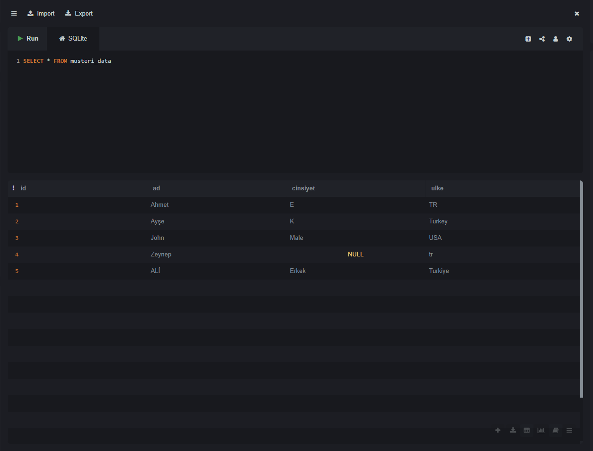
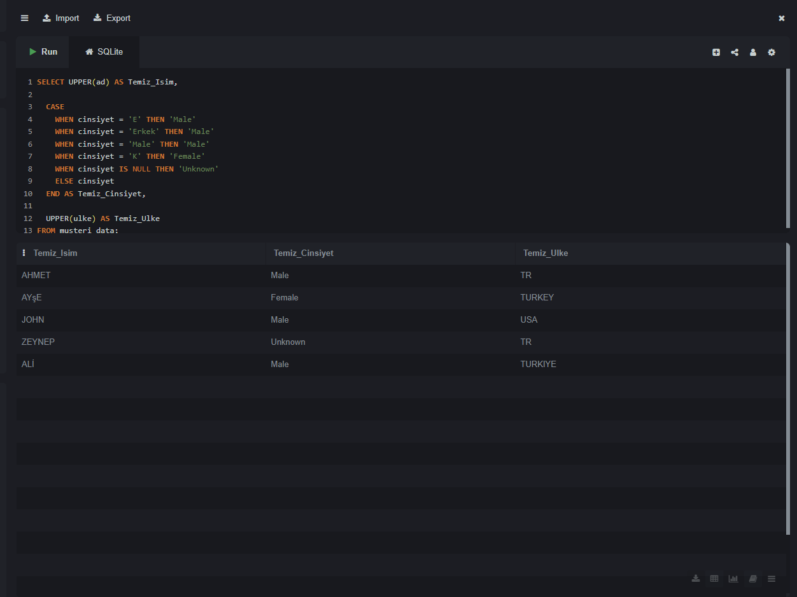

# 🧹 Customer Data Standardization Project

### 🚀 The Mission
Raw customer data is often messy, inconsistent, and unusable for analysis. My goal was to take a chaotic dataset and transform it into a standardized, "analysis-ready" format using SQL Logic.

---

### 🧠 The Logic (Methodology)
I applied **Predicate Logic** principles to handle inconsistencies without data loss.

* **Problem 1: Gender Inconsistency** (`E`, `Erkek`, `Male`, `K`)
    * *Solution:* Implemented a `CASE WHEN` logic gate to map diverse inputs to standard ISO formats (`Male`, `Female`).
* **Problem 2: Country Codes** (`TR`, `Turkey`, `tr`)
    * *Solution:* Standardized all variations to ISO-compliant Uppercase format (`UPPER` function).
* **Problem 3: Missing Information** (`NULL`)
    * *Solution:* Tagged all unknown values explicitly to prevent analysis errors (Data Integrity).

---

### 📸 Visual Proof (Before & After)

**1. The Dirty Data (BEFORE):**
> *Inconsistent capitalization, mixed languages, NULL values.*


**2. The Clean Data (AFTER):**
> *Standardized, readable, and ready for CRM integration.*


---

### 💻 The SQL Logic Used
```sql
CASE 
    WHEN gender IN ('E', 'Erkek', 'Male') THEN 'Male'
    WHEN gender = 'K' THEN 'Female'
    ELSE 'Unknown'
END AS Temiz_Cinsiyet
